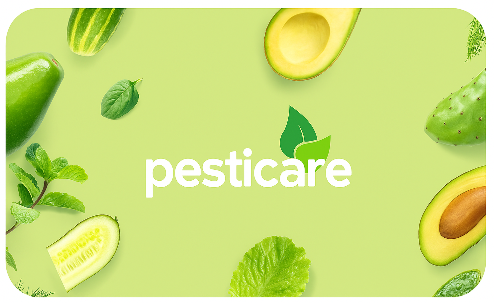

# 🌱 PestiCare Mobile

<div align="center">
  
  
  **AI-Powered Plant Disease Detection Mobile App**
  
  [](https://reactnative.dev/)
  [](https://expo.dev/)
  [](https://flask.palletsprojects.com/)
  [](https://www.tensorflow.org/lite)
  [](LICENSE)
</div>

## 📱 Overview

PestiCare Mobile is an advanced plant disease detection application that uses artificial intelligence to help farmers and gardeners identify plant diseases instantly. Simply capture or upload a photo of your plant, and get comprehensive analysis with treatment recommendations.

### ✨ Key Features

- 🔬 **AI-Powered Detection**: Advanced machine learning model trained on 15+ plant disease classes
- 📸 **Instant Analysis**: Real-time image processing with detailed results
- 💡 **Expert Recommendations**: Comprehensive treatment advice and prevention tips
- 🌿 **Multi-Plant Support**: Supports tomato, potato, and bell pepper plants
- 📱 **Cross-Platform**: Works on both iOS and Android devices
- 🔄 **Offline Ready**: Prepared for offline functionality (coming soon)

### 🎯 Supported Plant Diseases

| Plant Type | Diseases Detected |
|------------|-------------------|
| **Tomato** | Bacterial Spot, Early Blight, Late Blight, Leaf Mold, Septoria Leaf Spot, Spider Mites, Target Spot, Yellow Leaf Curl Virus, Mosaic Virus, Healthy |
| **Potato** | Early Blight, Late Blight, Healthy |
| **Bell Pepper** | Bacterial Spot, Healthy |

## 🚀 Quick Start

### Prerequisites

- **Node.js** 16+ 
- **Python** 3.8+
- **Expo CLI**: `npm install -g @expo/cli`
- **Git**

### 1. Clone Repository

```bash
git clone https://github.com/iamshaury/PestiCareMobile.git
cd PestiCareMobile
```

### 2. Backend Setup

```bash
# Navigate to backend directory
cd backend

# Create virtual environment
python -m venv venv

# Activate virtual environment
# Windows:
venv\Scripts\activate
# macOS/Linux:
source venv/bin/activate

# Install dependencies
pip install -r requirements.txt

# Start Flask server
python app.py
```

The backend will be available at `http://localhost:5000`

### 3. Frontend Setup

```bash
# Install dependencies
npm install

# Start Expo development server
npx expo start
```

### 4. Configure API Connection

Edit `config/api.ts` and update the `BASE_URL`:

```typescript
export const API_CONFIG = {
  // For iOS Simulator
  BASE_URL: 'http://localhost:5000',
  
  // For Android Emulator
  // BASE_URL: 'http://10.0.2.2:5000',
  
  // For Physical Device (replace with your computer's IP)
  // BASE_URL: 'http://192.168.1.XXX:5000',
};
```

## 🏗️ Project Structure

```
PestiCareMobile/
├── 📱 app/                     # React Native screens
│   ├── screens/
│   │   ├── (tabs)/            # Tab navigation screens
│   │   │   ├── index.tsx      # Home screen
│   │   │   ├── detect.tsx     # Disease detection screen
│   │   │   └── profile.tsx    # Profile screen
│   │   └── onbording.tsx      # Onboarding screen
│   └── _layout.tsx            # Root layout
├── 🔧 backend/                # Flask API server
│   ├── app.py                 # Main Flask application
│   ├── requirements.txt       # Python dependencies
│   ├── plant_disease_model.tflite  # AI model
│   └── class_indices.json     # Disease class mappings
├── ⚙️ config/                 # Configuration files
│   └── api.ts                 # API endpoints configuration
├── 🔌 services/               # API services
│   └── apiService.ts          # Backend communication service
├── 🎨 assets/                 # Images and fonts
└── 📚 docs/                   # Documentation
```

## 🛠️ Technology Stack

### Frontend
- **React Native** - Cross-platform mobile development
- **Expo** - Development platform and tools
- **TypeScript** - Type-safe JavaScript
- **React Native Paper** - Material Design components
- **Expo Router** - File-based navigation

### Backend
- **Flask** - Python web framework
- **TensorFlow Lite** - Machine learning inference
- **PIL (Pillow)** - Image processing
- **NumPy** - Numerical computing
- **Flask-CORS** - Cross-origin resource sharing

### AI/ML
- **TensorFlow Lite Model** - Optimized for mobile inference
- **Image Classification** - Convolutional Neural Network
- **15 Disease Classes** - Trained on plant disease dataset

## 📡 API Documentation

### Health Check
```http
GET /health
```

**Response:**
```json
{
  "status": "healthy",
  "message": "Plant Disease Detection API is running"
}
```

### Disease Prediction
```http
POST /predict
Content-Type: multipart/form-data
```

**Parameters:**
- `image` (file): Plant image (JPEG/PNG)

**Response:**
```json
{
  "disease_name": "Tomato - Early Blight",
  "class": "Tomato_Early_blight",
  "simple_name": "Tomato - Early Blight",
  "advice": "Remove infected leaves and use fungicide if needed.",
  "symptoms": "Dark brown spots with concentric rings on lower leaves...",
  "causes": "Fungal infection (Alternaria solani)...",
  "prevention": "Avoid overhead watering, rotate crops...",
  "treatment": "Remove affected leaves, apply recommended fungicide...",
  "confidence": 0.95,
  "is_healthy": false
}
```

## 📱 Usage

1. **Launch the App**: Open PestiCare on your mobile device
2. **Navigate to Detect**: Tap the "Detect" tab
3. **Capture Image**: Take a photo or select from gallery
4. **Get Results**: View detailed analysis and recommendations
5. **Follow Advice**: Implement suggested treatment plans

## 🔧 Development

### Running Tests
```bash
# Frontend
npm test

# Backend
cd backend
python -m pytest
```

### Building for Production
```bash
# Build APK
npx expo build:android

# Build IPA
npx expo build:ios
```

## 🤝 Contributing

1. Fork the repository
2. Create feature branch (`git checkout -b feature/amazing-feature`)
3. Commit changes (`git commit -m 'Add amazing feature'`)
4. Push to branch (`git push origin feature/amazing-feature`)
5. Open Pull Request

## 📄 License

This project is licensed under the MIT License - see the [LICENSE](LICENSE) file for details.

## 👨‍💻 Author

**Shaury**
- GitHub: [@iamshaury](https://github.com/iamshaury)
- Project: [PestiCare Mobile](https://github.com/iamshaury/PestiCareMobile)

## 🙏 Acknowledgments

- Plant disease dataset contributors
- TensorFlow Lite team
- React Native community
- Expo development platform

## 📞 Support

If you encounter any issues or have questions:

1. Check the [Setup Guide](SETUP.md)
2. Review [Troubleshooting](SETUP.md#troubleshooting)
3. Open an [Issue](https://github.com/iamshaury/PestiCareMobile/issues)

---

<div align="center">
  <p>Made with ❤️ for healthier plants</p>
  <p>⭐ Star this repository if you found it helpful!</p>
</div>
